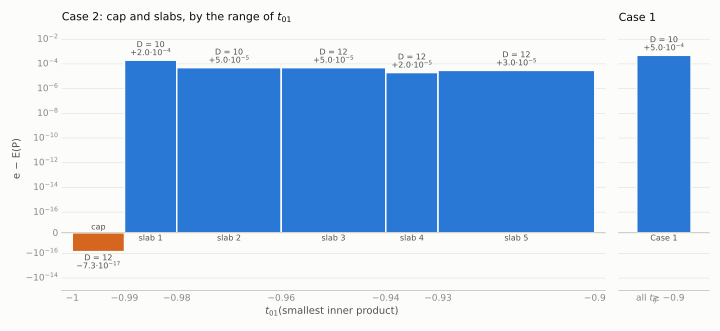
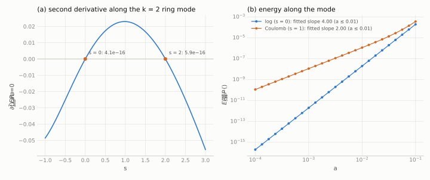
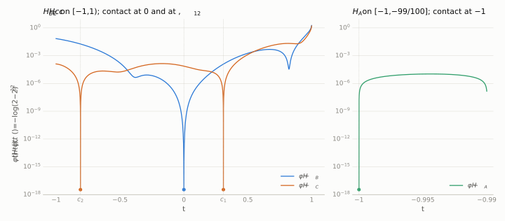
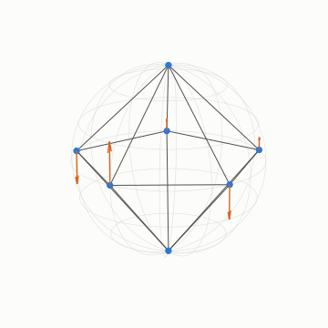

# Thomson problem, N = 7, logarithmic energy: computational certificates

Status: **computational certificates, not peer reviewed.** Prepared 2026-09-29.

For seven points on the unit sphere S² the logarithmic energy is E(x) = Σ_{i<j} −log‖x_i − x_j‖. The regular pentagonal
bipyramid P has E(P) = −log(1600√5). This repository contains exact certificates and checkers for the computational
steps of an argument, modelled on the Lean proof of the Coulomb case
([huwngtran/thomson-n7-lean](https://github.com/huwngtran/thomson-n7-lean)), that P minimises E among seven distinct
points. The configuration space is split by the smallest inner product. For every configuration with all
inner products ≥ −9/10, and for five slabs covering −99/100 ≤ t₀₁ ≤ −9/10 of the minimal pair, a three-point
semidefinite certificate gives a lower bound e > E(P). On the remaining cap t₀₁ ∈ [−1, −99/100], which contains P, the
certificate bound lies 7.3·10⁻¹⁷ below E(P). The checkers verify the certificate data exactly and the minorant
inequalities with ball arithmetic, and they verify the contact data used for coercivity on the cap.
`local/check_local_rigorous.py` verifies the constants and inequalities of a quartic local lemma near P. The lemma is
needed because the logarithmic energy has a flat second-order direction at P (`soft_mode/verify_soft_mode.py`).
The deductions that link these computations into a proof are paper-level steps taken from the Coulomb proof. They are
not machine-checked here. `METHOD.md` lists which steps are checked and which are not.

## Cells and margins

From `COVERAGE.md` (written by `checkers/make_coverage.py` during the verification run). "Degree" is the degree of
the three-point certificate.

| cell | range | degree | e − E(P) | checks |
|---|---|---|---|---|
| cap | t₀₁ ∈ [−1, −99/100] | 12 | −7.294·10⁻¹⁷ (sharp at P by design; closed by coercivity, ring rigidity and the local lemma) | ALL_OK, MINORANT_OK, coercivity OK (τ_B = 4.3·10⁻⁴ ≤ 1/1650) |
| Case 1 | all t_ij ≥ −9/10 | 10 | +5.000·10⁻⁴ | ALL_OK, MINORANT_OK |
| slab 1 | t₀₁ ∈ [−99/100, −49/50] | 10 | +2.000·10⁻⁴ | ALL_OK, MINORANT_OK |
| slab 2 | t₀₁ ∈ [−49/50, −24/25] | 10 | +5.000·10⁻⁵ | ALL_OK, MINORANT_OK |
| slab 3 | t₀₁ ∈ [−24/25, −47/50] | 12 | +5.000·10⁻⁵ | ALL_OK, MINORANT_OK |
| slab 4 | t₀₁ ∈ [−47/50, −93/100] | 12 | +2.000·10⁻⁵ | ALL_OK, MINORANT_OK |
| slab 5 | t₀₁ ∈ [−93/100, −9/10] | 12 | +3.000·10⁻⁵ | ALL_OK, MINORANT_OK |

The exact values of e (60 digits) and the certificate hashes are in `COVERAGE.md`. The local lemma checker gives
45/45 PASS. Its main output is E − E(P) ≥ 0.0342|w|² + 0.0227|s|⁴ on the gauge-fixed ℓ² ball of radius 1/100 around P.

`certificates/cells/calib_case1_coulomb_D10.json` is a Case-1 certificate for the Coulomb kernel from the same
pipeline (e − E(P) = +1.0·10⁻³). It serves as a calibration against the Coulomb proof and is not part of the
logarithmic case split.

## Figures

Regenerate with `python3 figures/make_figures.py` (matplotlib 3.9.4, mpmath, numpy; about 5 s on one core).

<picture>
  <source media="(prefers-color-scheme: dark)" srcset="figures/cells_dark.svg">
  
</picture>

e − E(P) per cell (symmetric-log axis), from the field `e` of each certificate in `certificates/` (cells listed in `certificates/cells.json`); D is the certificate degree.

<picture>
  <source media="(prefers-color-scheme: dark)" srcset="figures/soft_mode_dark.svg">
  
</picture>

(a) Second derivative at a = 0 of E_s(P_a) = Σ_{i<j} (‖x_i − x_j‖^{−s} − 1)/s (E_0 = E), where P_a is the k = 2 ring mode of `soft_mode/verify_soft_mode.py`, by central differences in mpmath; (b) E_s(P_a) − E_s(P) for s = 0 and s = 1, with least-squares slopes of the log–log data for a ≤ 0.01.

<picture>
  <source media="(prefers-color-scheme: dark)" srcset="figures/minorant_cap_dark.svg">
  
</picture>

φ(t) − H_X(t) for the minorants H_A, H_B, H_C of `certificates/cert_cap_log_D12.json` on their ranges, with the inner products of P (−1, 0, c₁, c₂) marked. Float evaluation; the certified bounds are in `verification/check_minorant.txt`.

<picture>
  <source media="(prefers-color-scheme: dark)" srcset="figures/configuration_dark.svg">
  
</picture>

P on S² (poles and equatorial pentagon); arrows: displacement of ring point k by a·cos(4πk/5) along the polar axis in the k = 2 ring mode P_a.

## Contents

| path | content |
|---|---|
| `certificates/cert_cap_log_D12.json` | cap certificate (5.8 MB of rationals) |
| `certificates/cells/` | Case 1 and slab certificates, plus the Coulomb calibration certificate |
| `certificates/cells.json` | the cells of the case split, in covering order |
| `checkers/` | `check_cert.py`, `check_minorant.py` (cap); `check_cell.py`, `check_minorant_cell.py` (other cells); `make_coverage.py` (all cells, writes `COVERAGE.md`) |
| `local/LOCAL_LEMMA.md`, `local/check_local_rigorous.py` | the quartic local lemma and its checker |
| `soft_mode/verify_soft_mode.py` | second derivative of the Riesz s-energy along the k = 2 ring mode (vanishes at s = 0 and s = 2) |
| `generate/` | scripts that produced the certificates (optional; see below) |
| `verification/` | outputs of every checker from the verification run, and the environment |
| `METHOD.md` | structure of the argument; checked and unchecked steps; references |
| `COVERAGE.md` | coverage table generated by `make_coverage.py` |
| `figures/` | figures and the script that makes them (`make_figures.py`) |
| `MANIFEST.sha256` | sha256 of every file |

## Reproduce

Requirements: Python 3 with `python-flint`, `mpmath`, `sympy` and `numpy` (numpy only for the local lemma checker and the figures), and `matplotlib` for the figures.
The versions used were Python 3.9.6, python-flint 0.6.0, mpmath 1.3.0, sympy 1.14.0, numpy 1.26.4 and matplotlib 3.9.4, on macOS arm64.
Each checker runs on one core. The runtimes below were measured under heavy machine load (load average about 28).

```sh
export OMP_NUM_THREADS=1
python3 checkers/check_cert.py certificates/cert_cap_log_D12.json            # cap, exact: ALL_OK            (~25 s)
python3 checkers/check_minorant.py certificates/cert_cap_log_D12.json 1e-16  # cap minorants + coercivity     (<1 s)
python3 checkers/check_cell.py certificates/cells/cert_*_log_*.json          # Case 1 + slabs, exact          (~2 min)
python3 checkers/check_minorant_cell.py certificates/cells/cert_*_log_*.json # minorants, arb                 (~1 s)
python3 checkers/check_cell.py certificates/cells/calib_case1_coulomb_D10.json  # Coulomb calibration         (~3 s)
python3 checkers/make_coverage.py                                            # all of the cap and cells, writes COVERAGE.md (~3 min)
python3 local/check_local_rigorous.py                                        # local lemma: 45/45 PASS        (~1.5 min)
python3 soft_mode/verify_soft_mode.py                                        # flat mode, numerical           (<1 s)
python3 figures/make_figures.py                                              # figures, matplotlib 3.9.4      (~5 s)
sha256sum -c MANIFEST.sha256                                                 # or: shasum -a 256 -c MANIFEST.sha256
```

Each checker exits with status 0 only if all of its checks pass.

## Generators (not needed for verification)

`generate/` contains the scripts that produced the certificates: float SDP solves with Clarabel via cvxpy
(`sdp_soft.py` for the cap, `sdp_cell.py` for the other cells, with `polyk.py` and `spec.py`), an exact facial
reduction for the cap (`face.py`), and exact rounding (`round_exact.py`, `round_cell.py`). The checkers do not import
them. The float solves take 10–20 minutes each and were not re-run for this repository. The intermediate float solutions
are not included. The verification run did re-run `face.py` (its output matches the file used to build the cap
certificate) and imported the other scripts (`verification/generate_smoke.txt`). Additional versions used: cvxpy
1.7.5, clarabel 0.11.1, scipy 1.13.1. Cap pipeline, run from `generate/`:
`python3 face.py; python3 sdp_soft.py mu; cp sol_mu.npz sol_mu_contact.npz; SHIFT_A=4.5e-7 python3 round_exact.py sol_mu_contact.npz`.
Cells: `POLYD=12 python3 sdp_cell.py slab:-0.93:-0.9 mu 3e-5`, then `python3 round_cell.py sol/<tag>.npz OUT.json`
(`POLYD=10` for Case 1 (`case1:-0.9`) and the first two slabs, `KER=1` for Coulomb).
